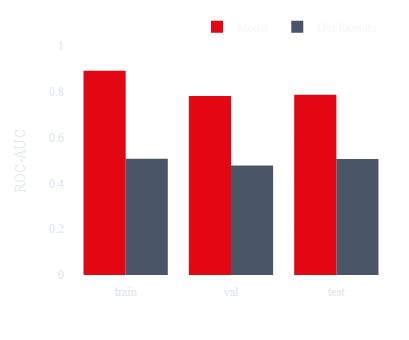
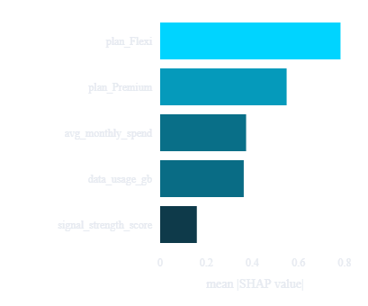

# SIA: Strategic Intelligence Agent
## Enterprise-Grade Autonomous Retention Engine for Telecommunications

SIA (Strategic Intelligence Agent) is an autonomous multi-agent system designed to combat customer churn in the telecommunications industry.  
It leverages **stateful agent orchestration** and **low-latency LLM reasoning** to convert subscriber data into **actionable, personalized retention strategies**.

---

## System Architecture

SIA operates on a **Stateful Directed Acyclic Graph (DAG)**, ensuring controlled data flow, agent isolation, and session-aware reasoning.

### Core Agents

**Monitor Agent**
- Continuously scans subscriber data using neural churn-risk thresholds
- Uses smart memory to exclude users already processed

**Strategy Decider (Llama-3.3-70B via Groq)**
- Performs low-latency reasoning on high-risk subscribers
- Generates personalized interventions:
  - Magic Bundles
  - Network Discounts
  - Recharge Incentives

**Execution Auditor**
- Validates strategy logic before execution
- Writes all actions to an immutable audit ledger
- Updates BI dashboards for real-time tracking

---

## Tech Stack

| Layer              | Technology                                   |
|--------------------|----------------------------------------------|
| Agentic Framework  | LangGraph (Stateful Orchestration)            |
| Reasoning Engine   | Llama-3.3-70B-Versatile (Groq Cloud)          |
| Frontend / UI      | Streamlit (Custom Glassmorphic UI)            |
| Data Analytics     | Pandas, NumPy, Plotly Express                |
| State Management   | Python TypedDict, Streamlit Session State     |

---

## Strategic Modules

### 1. Real-Time Monitoring & Deployment
- Batch execution in 5-user segments to preserve LLM reasoning quality
- Real-time log cross-checking removes processed users immediately

### 2. Predictive Analytics
- Revenue Protection Matrix showing defended Monthly Recurring Revenue (MRR)
- Live churn-risk distribution across the subscriber base

### 3. Audit Ledger
- Full transparency with timestamped autonomous decisions
- Designed for compliance and human oversight

---

## Installation & Setup

### Prerequisites
- Python 3.10 or higher
- Groq API Key (https://console.groq.com)

### Clone Repository
```bash
git clone https://github.com/AmaedaQ/sia-retention-ai-agent.git
cd sia-retention-ai-agent
pip install -r requirements.txt
````

### Environment Configuration

Create a `.env` file in the root directory:

```env
GROQ_API_KEY=your_actual_api_key_here
```

### Run the System

```bash
# Generate synthetic subscriber data
python backend/data_generator.py

# Launch the application
streamlit run frontend/app.py
```

---

## Core Business Impact

* **Revenue Preservation**
  Automatically identifies and retains high-value subscribers before churn.

* **Operational Scalability**
  Eliminates manual churn analysis using sub-second AI-driven reasoning.

* **Hyper-Personalization**
  Replaces generic campaigns with individualized retention strategies.

## Real ML risk scoring: before and after

**Before:** the churn-risk score came from a hand-written linear formula
over synthetic demo data:

```
risk = (days_since_last_recharge / 45) * 0.4
     + (1 - signal_strength_score) * 0.4
     + support_tickets_open * 0.2
```

No training, no validation, no honest accuracy number — the dashboard's
old "Success Rate: 94.2%" metric was a hardcoded placeholder, not a
measurement of anything.

**After:** the score comes from a trained XGBoost classifier on the real
[IBM/Kaggle Telco Customer Churn dataset](https://www.kaggle.com/datasets/blastchar/telco-customer-churn)
(7,032 real customers after cleaning), mapped to SIA's `Subscriber`
schema and published openly:

* Dataset: [amaedaqureshi/sia-churn-dataset](https://huggingface.co/datasets/amaedaqureshi/sia-churn-dataset)
* Model: [amaedaqureshi/sia-churn-model](https://huggingface.co/amaedaqureshi/sia-churn-model) (`v1.0.0`)
* Test-set ROC-AUC: **0.7869** (model) vs. **0.5066** (the old formula,
  scored on the exact same held-out rows) — the full breakdown by split,
  plus the SHAP feature-importance ranking, is in the model repo's
  `metrics.json` and rendered live in the dashboard's **Evaluation** tab.

The model is wired in behind a feature flag (`USE_ML_MODEL` in
`config/settings.py`): when it's off, or the model can't be reached,
`backend/agents/monitor.py` falls back to the original formula
automatically — nothing breaks, it's just less accurate. Predictions also
carry a `risk_source` tag (`"model"` or `"formula"`) and, when the model
is used, per-prediction SHAP top factors, so it's always visible which
path produced a given score.

This was built in five phases (0: contracts/config/tests, 1: real dataset
pipeline, 2: training + evaluation + explainability, 3: wiring the model
into the live pipeline, 4: retiring the hardcoded metric and adding this
section plus the dashboard's Evaluation tab), entirely on free-tier
compute (Google Colab + Hugging Face Hub, no paid GPU or API needed). See
`backend/schemas.py` and `config/settings.py` for the contracts this is
built around, and `notebooks/README.md` for how to reproduce training.

**Phase 1 status:** `notebooks/01_data_pipeline.py` loads the real
[IBM/Kaggle Telco Customer Churn dataset](https://www.kaggle.com/datasets/blastchar/telco-customer-churn)
(~7,043 customers, 26.58% churn rate), cleans it, adds four clearly
documented synthetic bridge columns for fields this dataset doesn't have,
validates every row against the `Subscriber` schema, and writes a
stratified train/val/test split to `data/processed/` — see
`data/processed/DATASET_CARD.md` for exactly what's real vs. synthetic,
and `notebooks/README.md` for how to push the result to Hugging Face.

### Model evaluation (live from the dashboard's Evaluation tab)

Real numbers, straight from the published model at
[amaedaqureshi/sia-churn-model](https://huggingface.co/amaedaqureshi/sia-churn-model)
(`v1.0.0`), rendered by the Streamlit app's **Evaluation** tab:

| Metric | Value |
|---|---|
| Model Version | `v1.0.0` |
| Test ROC-AUC (model) | **0.7869** |
| Test ROC-AUC (old formula) | 0.5066 (`-0.2803` vs. model) |

Both scores are computed on the exact same held-out test rows — the old
formula is the literal one from `backend/data_generator.py`
(`(days_since_last_recharge/45)*0.4 + (1-signal_strength_score)*0.4 +
support_tickets_open*0.2`), scored here only for comparison, never used
for actual predictions once `USE_ML_MODEL` is on.

**Model vs. old formula, ROC-AUC by split:**



**Top features by mean absolute SHAP value (test split):**



`plan_Flexi` and `plan_Premium` dominate, followed by `avg_monthly_spend`
and `data_usage_gb` — the model is keying off real subscriber behavior,
not noise. `signal_strength_score` (one of the four synthetic bridge
columns — see `data/processed/DATASET_CARD.md`) has the smallest but
still non-trivial weight, worth remembering before quoting it in any
user-facing explanation.

A real ROC curve, PR curve, and confusion matrix are supported by the
Evaluation tab too, but need `test_raw.json` (per-row test predictions)
published alongside `metrics.json` — see `notebooks/02_train_model.py`
and `scripts/push_model_to_hf.py`. **Open item:** a retrain was run and
`test_raw.json` was uploaded to the `amaedaqureshi/sia-churn-model` repo,
but the dashboard still reports it as missing under the `v1.0.0` revision
pin — most likely because Hugging Face's `create_tag(..., exist_ok=True)`
doesn't move an existing tag to a new commit, so `v1.0.0` may still point
at the original publish. Needs checking (either re-tag to a new version
like `v1.0.1`, or delete and recreate the `v1.0.0` tag) before the curves
will show up live.

---

---

## Contribution & Contact

Developed by **Amaeda Qureshi**.
Contributions to agent logic, analytics, or UI/UX are welcome via pull requests.

* GitHub: [https://github.com/AmaedaQ](https://github.com/AmaedaQ)
* LinkedIn: [https://www.linkedin.com/in/amaeda-qureshi-305bb928a](https://www.linkedin.com/in/amaeda-qureshi-305bb928a)

---

**Built for the Future of Autonomous Telecom Operations**
